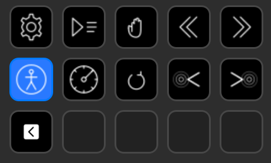

# VoiceOver Stream Deck Plugin

A Stream Deck plugin for controlling VoiceOver on macOS. Designed to simplify accessibility testing by putting common VoiceOver commands at your fingertips via physical keys on the Elgato Stream Deck.



## Features

- **Toggle VoiceOver** — Turn VoiceOver on or off with a single key press
- **Interrupt Speech** — Stop the current speech output immediately
- **Speed Control** — Increase or decrease the VoiceOver speech rate
- **Navigation** — Move to the next or previous element on the page
- **Rotor** — Open the VoiceOver rotor for quick access to headings, links, and form elements

## Requirements

- macOS 13.0 or later
- Elgato Stream Deck with Stream Deck Software 6.4+
- Node.js 20+
- [Stream Deck CLI](https://docs.elgato.com/streamdeck/cli) (`npm install -g @elgato/cli`)

## Installation

1. Install the [Stream Deck CLI](https://docs.elgato.com/streamdeck/cli) and enable developer mode (only needed once):

   ```bash
   npm install -g @elgato/cli
   streamdeck dev
   ```

2. Clone the repository and install dependencies:

   ```bash
   git clone https://github.com/d-koppenhagen/stream-deck-plugin-vo.git
   cd stream-deck-plugin-vo
   npm install
   ```

3. Build and deploy the plugin locally:

   ```bash
   npm run deploy
   ```

   This compiles TypeScript, assembles the `.sdPlugin` bundle, links it into Stream Deck, and restarts the plugin.

4. On first deploy you may need to restart the Stream Deck app (Cmd+Q, then reopen). After that, the actions appear under the "VoiceOver Control" category.

5. Make sure the Stream Deck app has Accessibility permissions:
   System Settings → Privacy & Security → Accessibility → enable "Elgato Stream Deck"

## Usage

Drag any of the following actions from the "VoiceOver Control" category onto your Stream Deck:

| Action | Description |
| --- | --- |
| VoiceOver Toggle | Turn VoiceOver on or off |
| Interrupt Speech | Stop current speech output |
| Speed Up | Increase speech rate |
| Speed Down | Decrease speech rate |
| Next Element | Navigate to the next element |
| Previous Element | Navigate to the previous element |
| Open Rotor | Open the VoiceOver rotor |

## Development

### Prerequisites

1. [Node.js](https://nodejs.org/) 20 or later (e.g. via [nvm](https://github.com/nvm-sh/nvm))
2. [Stream Deck CLI](https://docs.elgato.com/streamdeck/cli): `npm install -g @elgato/cli`
3. Enable developer mode (once): `streamdeck dev`

### npm Scripts

| Script | Description |
| --- | --- |
| `npm test` | Run unit and property-based tests via Vitest |
| `npm run build` | Compile + assemble the `com.voiceover-streamdeck.sdPlugin/` bundle |
| `npm run deploy` | Full local deploy: build, link into Stream Deck, and restart the plugin |
| `npm run dev` | Watch mode — recompiles on file changes (restart plugin manually) |

### Validating the Plugin

Run the Stream Deck CLI validator against the built bundle to catch manifest or structure issues early:

```bash
npm run build
```

### Rebuilding After Changes

Once linked, rebuild and restart the plugin to pick up code changes:

```bash
npm run build
streamdeck restart com.voiceover-streamdeck
```

Or use the deploy script which does both:

```bash
npm run deploy
```

### Debugging

With developer mode enabled, you can attach a debugger (e.g. VS Code) to the running Node.js plugin process. The manifest has `"Debug": "enabled"` set.

Check the Stream Deck logs for plugin errors:

```bash
ls ~/Library/Logs/ElgatoStreamDeck/
```

### Unlinking

To remove the plugin from Stream Deck:

```bash
streamdeck unlink com.voiceover-streamdeck.sdPlugin
```

## Contributing

Contributions are welcome! To get started:

1. Fork the repository
2. Create a feature branch (`git checkout -b feature/my-feature`)
3. Commit your changes (`git commit -m "Add my feature"`)
4. Push to the branch (`git push origin feature/my-feature`)
5. Open a Pull Request

Please make sure all tests pass (`npm test`) before submitting a PR.

## License

This project is licensed under the [MIT License](LICENSE).
